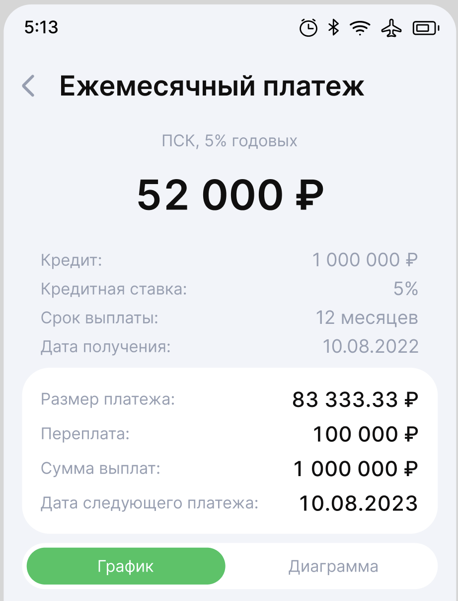
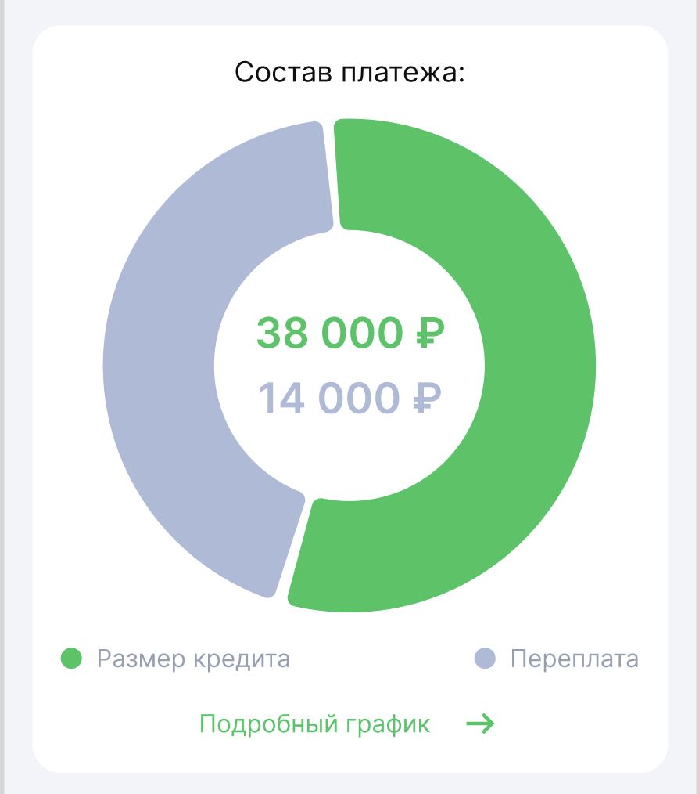

# LoanCalculatorKmp

Kotlin Multiplatform приложение для расчёта кредитных платежей. Работает на **Android**, **iOS** и **Desktop (JVM)**.

## Скриншоты

| Калькулятор | Результаты | График платежей |
|------------|-----------|----------------|
|  |  |  |

## Возможности

- Расчёт **аннуитетных** и **дифференцированных** платежей
- График платежей с разбивкой по месяцам (основной долг / проценты)
- Визуализация соотношения тела кредита и переплаты (donut-диаграмма)
- Настройка срока в днях, месяцах или годах
- Форматирование чисел с разделителями тысяч

## Стек технологий

| Категория | Библиотека | Версия |
|-----------|-----------|--------|
| UI | Compose Multiplatform | 1.10.0 |
| Язык | Kotlin | 2.3.0 |
| Архитектура | AndroidX ViewModel + StateFlow | 2.10.0-alpha07 |
| Навигация | Navigation3 (Compose) | 1.0.0-alpha06 |
| Дата/Время | kotlinx-datetime | 0.6.1 |
| Сериализация | kotlinx-serialization-json | 1.9.0 |
| HTTP | Ktor Client | 3.1.2 |
| Android min SDK | — | 24 |

## Структура проекта

```
LoanCalculatorKmp/
├── composeApp/
│   └── src/
│       ├── commonMain/          # Общий код (UI, логика, модели)
│       │   └── kotlin/com/mickey/loan_calc/
│       │       ├── App.kt
│       │       ├── navigation/  # Маршруты и навигационная панель
│       │       ├── calculator/  # Экран калькулятора + бизнес-логика
│       │       └── result/      # Экран результатов
│       ├── androidMain/         # Android-специфичный код
│       ├── iosMain/             # iOS-специфичный код
│       └── desktopMain/         # Desktop-специфичный код
├── iosApp/                      # Xcode-проект для iOS
├── docs/                        # Дополнительная документация
│   ├── architecture.md
│   ├── data-models.md
│   ├── screens.md
│   └── calculation-logic.md
├── gradle/
│   └── libs.versions.toml       # Версии зависимостей (Version Catalog)
└── README.md
```

## Архитектура

Приложение следует **MVI-подобному паттерну** на основе ViewModel + StateFlow:

```
UI (Composable)
    │  user event
    ▼
ViewModel
    │  state update
    ▼
StateFlow<UiState>
    │  collectAsState()
    ▼
UI (recompose)
```

Подробнее: [`docs/architecture.md`](docs/architecture.md)

## Быстрый старт

### Требования

- JDK 17+
- Android Studio Meerkat (2025.1) или новее
- Xcode 16+ (для iOS)

### Запуск Android

```bash
# macOS / Linux
./gradlew :composeApp:assembleDebug

# Windows
.\gradlew.bat :composeApp:assembleDebug
```

### Запуск Desktop

```bash
./gradlew :composeApp:run
```

### Запуск iOS

Открыть `iosApp/iosApp.xcodeproj` в Xcode и запустить на симуляторе или устройстве.

## Документация

| Документ | Описание |
|---------|---------|
| [`docs/architecture.md`](docs/architecture.md) | Архитектурные решения и паттерны |
| [`docs/data-models.md`](docs/data-models.md) | Схемы данных и модели |
| [`docs/screens.md`](docs/screens.md) | Описание экранов и навигации |
| [`docs/calculation-logic.md`](docs/calculation-logic.md) | Формулы расчёта платежей |

---

Подробнее о [Kotlin Multiplatform](https://www.jetbrains.com/help/kotlin-multiplatform-dev/get-started.html).
